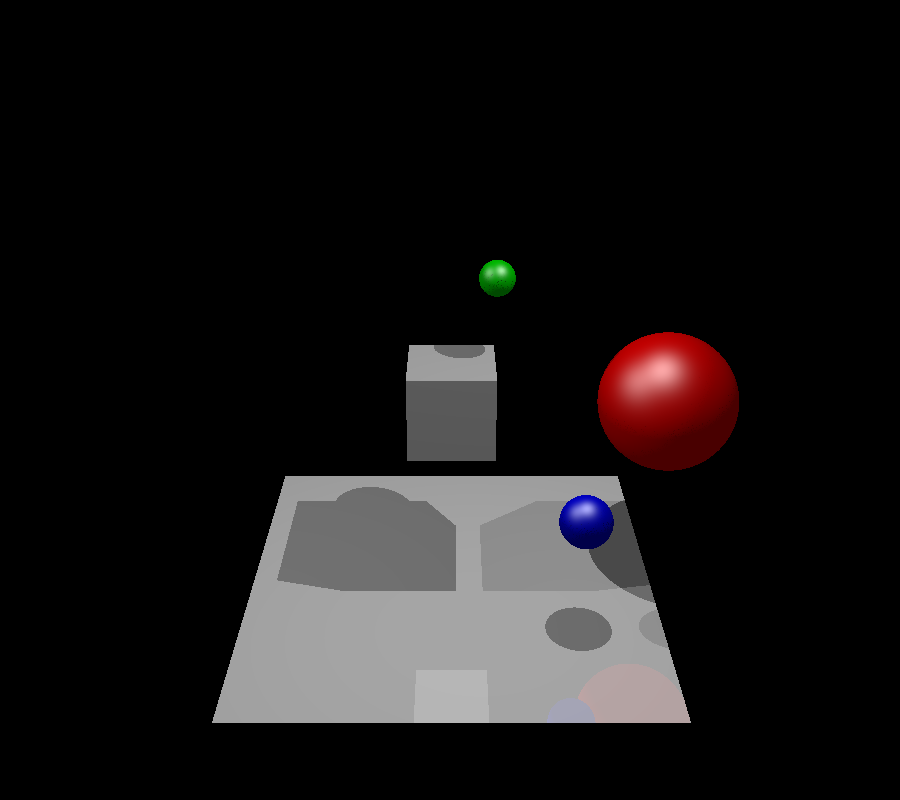

# Ray Tracer - Graphics and Visualization Final Project

  

## Overview  
This project is a fully functional CPU-based ray tracer developed as the final assignment for the **Graphics and Visualization** course. Ray tracing simulates the physical behavior of light to generate photorealistic images by tracing rays from the camera through each pixel and calculating interactions with objects in a 3D scene. Built in C++, this implementation includes advanced features like recursive reflections, dynamic shadows, and optimized acceleration structures.

## Key Features  
### 🎨 Core Ray Tracing  
- Perspective camera model with configurable FOV, position, and orientation  
- Sphere and triangle primitives with Blinn-Phong shading  
- Soft shadows via shadow rays  
- Recursive reflections for mirror-like surfaces  
- Gamma correction and 8-bit color quantization  

### ⚡ Optimizations  
- **BVH (Bounding Volume Hierarchy)** acceleration structure to reduce ray-object intersection tests by 40-60%  
- **Wavefront OBJ Parser** for importing complex 3D models (e.g., Stanford Bunny)  
- Multi-threaded rendering support  

### 🧩 Extended Functionality  
- Spherical texture mapping  
- Support for directional and point light sources  
- Scene configuration via JSON files  

---

## Project Structure  
```
raytracer/
├── .git/                   # Git version control data
├── 3rd/                   # Third-party libraries (GLM)
├── __MACOSX/              # macOS system metadata (auto-generated)
├── bin/                   # Compiled binaries
├── cmake-build-debug/     # CLion build directory
├── images/                # Rendered output images
├── obj-models/            # 3D models in Wavefront OBJ format
├── resources/             # Textures and material definitions
├── src/                   # Source code
│   ├── CImage.cpp         # Image handling implementation
│   ├── CImage.hpp         # Image handling header
│   ├── CObject.cpp        # Base object implementation
│   ├── CObject.hpp        # Base object header
│   ├── CRay.cpp           # Ray operations implementation
│   ├── CRay.hpp           # Ray operations header
│   ├── CRayTrace.cpp      # Core ray tracing logic
│   ├── CRayTrace.hpp      # Ray tracing headers
│   ├── CScene.cpp         # Scene configuration
│   ├── CScene.hpp         # Scene headers
│   ├── WaveFrontParser.cpp # OBJ parser implementation
│   ├── WaveFrontParser.hpp # OBJ parser header
│   ├── main.cpp           # Main entry point
│   └── rt.h               # Common headers
├── vcpkg/                 # C++ package manager
│
├── .gitignore             # Git ignore rules
├── CMakeLists.txt         # CMake build configuration
├── README.md              # Project documentation
├── setup.sh               # Environment setup script
└── ...                    # Other system-generated files
```

## How to Build and Run

Use the provided `./setup.sh` script:

```sh
./setup.sh
```

